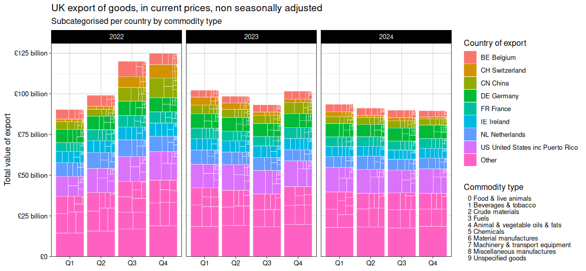

<!-- README.md is generated from README.Rmd. Please edit that file -->

```{r, include = FALSE}
knitr::opts_chunk$set(
  collapse = TRUE,
  comment = "#>",
  fig.path = "man/figures/README-",
  out.width = "100%",
  dpi = 300
)
```

# ggtreebar

<!-- badges: start -->
<!-- badges: end -->



The goal of ggtreebar is to provide `ggplot2` geoms analogous to `geom_col()`
and `geom_bar()` that allow for treemaps using `treemapify` nested within each
bar segment.

## Installation

You can install the development version of ggtreebar like so:

``` r
# install.packages("devtools")
devtools::install_github("hrryt/ggtreebar")
```

## Example

This is a basic example which shows you how to solve a common problem:

```{r example}
library(ggplot2)
library(ggtreebar)
ggplot(diamonds, aes(clarity, fill = cut, subgroup = color)) +
  geom_treebar()
ggplot(diamonds, aes(clarity, fill = cut, subgroup = cut, subgroup2 = color)) +
  geom_treebar() +
  geom_treebar_subgroup_border() +
  geom_treebar_subgroup2_text()
ggplot(diamonds, aes(y = cut, fill = color, subgroup = clarity)) +
  geom_treebar(position = "dodge")
```
