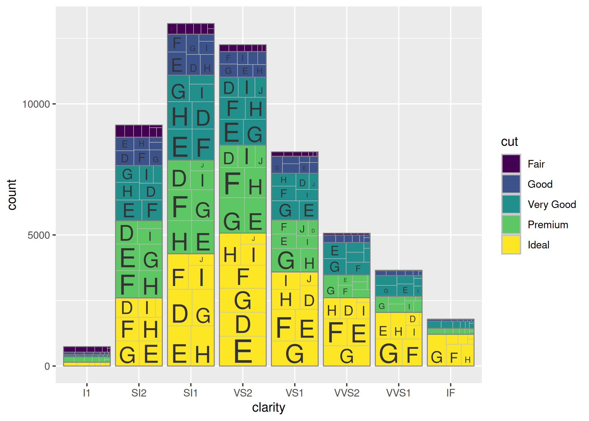

<!-- README.md is generated from README.Rmd. Please edit that file -->

# ggtreebar

<!-- badges: start -->

<!-- badges: end -->


The goal of ggtreebar is to provide `ggplot2` geoms analogous to
`geom_col()` and `geom_bar()` that allow for treemaps using `treemapify`
nested within each bar segment.

## Installation

You can install ggtreebar with the following command:

``` r
install.packages("ggtreebar")
```

You can install the development version of ggtreebar like so:

``` r
# install.packages("pak")
pak::pak("hrryt/ggtreebar")
```

## Example

This is a basic example which shows you how to solve a common problem:

``` r
library(ggplot2)
library(ggtreebar)
ggplot(diamonds, aes(clarity, fill = cut, subgroup = color)) +
  geom_treebar()
```


``` r
ggplot(diamonds, aes(clarity, fill = cut, subgroup = cut, subgroup2 = color)) +
  geom_treebar() +
  geom_treebar_subgroup_border() +
  geom_treebar_subgroup2_text()
```



``` r
ggplot(diamonds, aes(y = cut, fill = color, subgroup = clarity)) +
  geom_treebar(position = "dodge")
```


